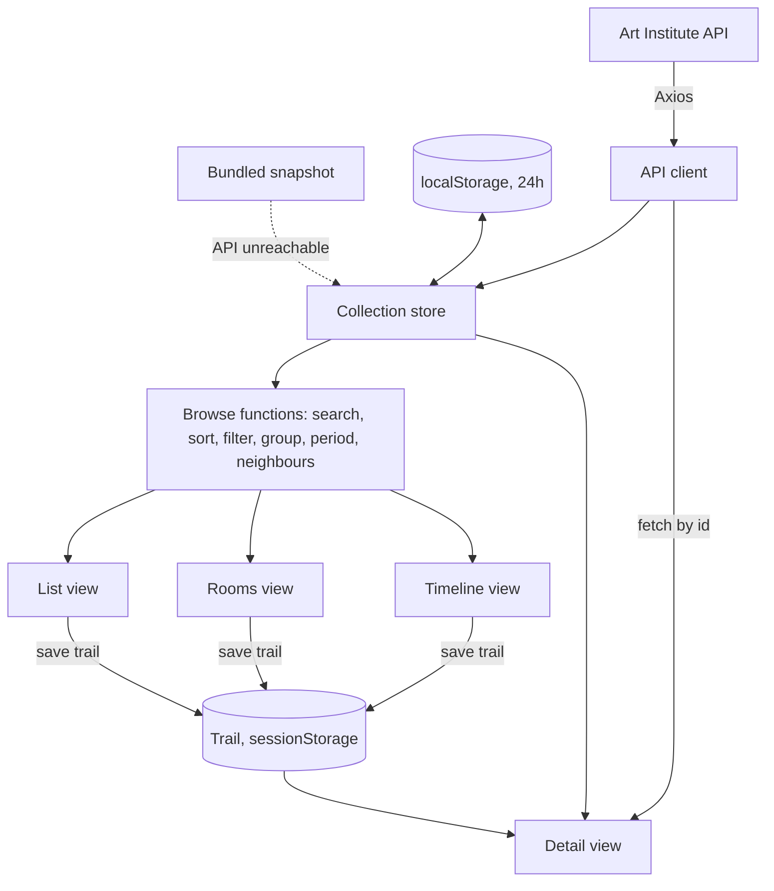
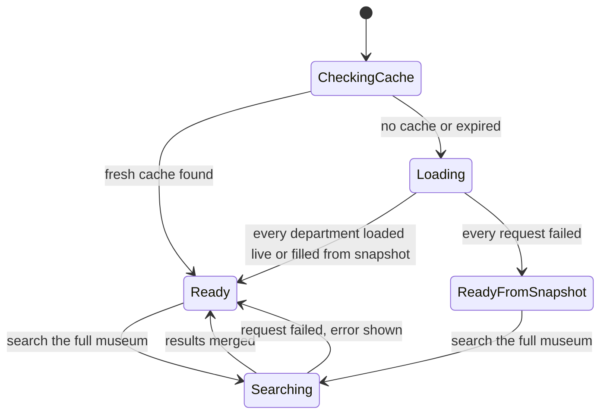
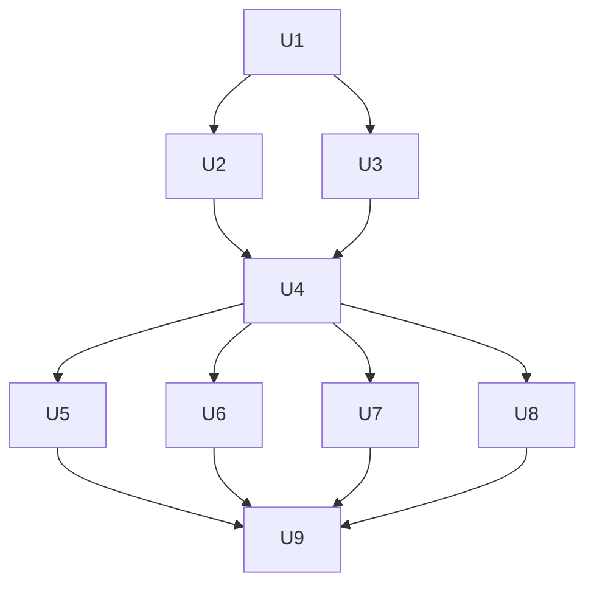

# Museum Rooms App - Plan

## Goal Capsule

- **Objective:** Build the CS 409 MP2 single-page app: a museum walk over the Art Institute of Chicago's public-domain collection with List, Rooms, Timeline and Detail views.
- **Product authority:** The grading breakdown and rules in `README.md` are binding. Where this plan and `README.md` disagree, `README.md` wins.
- **Deadline:** Tuesday, Oct 6, 2026, 11:59 PM CT.
- **Open blockers:** None.
- **Authority order:** `README.md`, then the Product Contract, then the Planning Contract. Implementation Units are guidance and yield to all three.
- **Stop conditions:** Stop and ask before pushing to `main`, since a push deploys the public site. Stop if a requirement cannot be met without inline styles or without the chosen API.
- **Tail ownership:** The executor commits locally. The repo owner approves pushes, records the demo video and submits the form.
- **Product Contract preservation:** Product Contract unchanged, except that the three Outstanding Questions are resolved in place as Key Technical Decisions.

---

## Product Contract

### Summary

A visitor browses Art Institute of Chicago artworks three ways: a searchable, sortable List, a Rooms gallery with one room per department, and a Timeline.
Any artwork opens a linkable detail page with a filmstrip of neighbouring works for previous and next.
The app starts on a starter collection and can pull more works from the full museum on request.

### Problem Frame

MP2 is graded against a fixed rubric worth 100 points, 10 of them for design.
The rubric names three views and specific behaviours in each, so a creative layout earns nothing if a grader cannot recognise the list, the gallery, or the detail view in it.
The assignment is demonstrated in a 3-minute video on the deployed site, and the chosen API may be slow or unavailable at that moment.

### Key Decisions

- **Art Institute of Chicago API.** (session-settled: user-directed — chosen over PokeAPI, TMDB and TheMealDB: no API key, strong imagery, more distinctive design.) Some records lack images, dates or artists, and the app must tolerate that.
- **Hybrid collection.** (session-settled: user-directed — chosen over a fixed-only collection and over live-only search: instant browsing on a starter set plus reach into the whole museum.)
- **Museum Rooms layout.** (session-settled: user-directed — chosen over seven other sketched layouts: the gallery is a row of rooms and the detail page has a filmstrip.)
- **Timeline is a fourth view, not the gallery.** (session-settled: user-directed — chosen over using the Timeline as the gallery view: Rooms carries the graded gallery requirements, so the Timeline cannot cost points.)
- **Previous and next follow the view the visitor came from.** (session-settled: user-approved — chosen over one global order: the neighbours shown in the filmstrip match what the visitor was just looking at.)
- **Filtered-out rooms dim; filtered-out artworks are removed.** (session-settled: user-approved — chosen over hiding empty rooms: the museum's shape stays stable while filtering.) Inside a room, only matching artworks are shown, so a grader sees the results change.

### Requirements

**Collection**

- R1. On first load the app shows a starter collection of several hundred public-domain artworks, each with an image.
- R2. The starter collection is cached so that returning visits and view changes do not refetch it.
- R3. A "search the full museum" action fetches matching artworks from the API and adds them to the collection for the rest of the session.
- R4. Artworks without an image or outside the public domain are never shown.
- R5. When the API fails or is slow, the app shows a clear message and keeps working with whatever it already has.
- R6. Missing fields on an artwork, such as artist or date, display as "Unknown" and never break a view.

**List view**

- R7. The List shows artworks from the collection with thumbnail, title, artist and year.
- R8. A search bar filters the List as the visitor types, matching on title and artist.
- R9. The List can be sorted by at least title, artist and year.
- R10. Every sort can be switched between ascending and descending.
- R11. Clicking a List row opens that artwork's detail page.

**Rooms view (gallery)**

- R12. The Rooms view shows artwork images grouped into one room per department, in a row that scrolls sideways.
- R13. Visitors can select one or many filter values across department and artwork type.
- R14. With filters active, each room shows only its matching artworks, and rooms with no matches are dimmed.
- R15. Clicking an image in a room opens that artwork's detail page.

**Timeline view**

- R16. The Timeline arranges artworks along a time axis by year.
- R17. Artworks with no usable year are left off the Timeline and remain in the List and Rooms.
- R18. Clicking an artwork on the Timeline opens its detail page.

**Detail view**

- R19. Each artwork has its own URL, and opening that URL directly shows the artwork.
- R20. The detail page shows a large image and the artwork's title, artist, date, medium, department, artwork type, place of origin and style.
- R21. Previous and Next buttons move to the neighbouring artwork in the order of the view the visitor came from, including that view's search, sort and filters.
- R22. A filmstrip shows the current artwork among its neighbours, and clicking a neighbour opens it.
- R23. At the first or last artwork, Previous or Next wraps around to the other end.
- R24. When a detail URL is opened directly, previous and next use the starter collection's default order.
- R25. A link returns the visitor to the view they came from.

**Assignment constraints**

- R26. The app uses React with TypeScript, React Router for routing, and Axios for API calls.
- R27. The app has no inline styles, no inline script tags, and no HTML tables used for layout.
- R28. The app is deployed to GitHub Pages and every route works under the `/mp2/` base path.
- R29. The layout is usable on both a laptop and a phone-width screen.

### Key Flows

- F1. Search and open from the List
  - **Trigger:** Visitor types in the List search bar.
  - **Steps:** Results narrow with each keystroke; visitor changes sort and direction; visitor clicks a row; detail page opens; Next moves through the sorted, filtered results.
  - **Covered by:** R7, R8, R9, R10, R11, R21
- F2. Filter rooms and open from the gallery
  - **Trigger:** Visitor selects two departments and one artwork type in Rooms.
  - **Steps:** Matching rooms show matching works; other rooms dim; visitor clicks an image; detail page opens with a filmstrip of that room's matching works.
  - **Covered by:** R12, R13, R14, R15, R22
- F3. Reach beyond the starter collection
  - **Trigger:** Visitor's search finds little or nothing and they choose "search the full museum".
  - **Steps:** App fetches matches; new works appear in the List, join their department's room, and appear on the Timeline.
  - **Covered by:** R3, R4, R5
- F4. Arrive by link
  - **Trigger:** Visitor opens a detail URL directly.
  - **Steps:** App loads that artwork even if it is outside the starter collection; previous and next use the default order.
  - **Covered by:** R19, R24

### Acceptance Examples

- AE1. **Covers R8, R10.** Given the List sorted by year descending, when the visitor types "monet", then only works matching "monet" in title or artist remain, still in year-descending order.
- AE2. **Covers R14.** Given filters "Painting" and "Arts of Asia", when a room has no matching works, then the room is dimmed and shows no artworks.
- AE3. **Covers R21.** Given the visitor opened the third of five search results, when they press Next twice, then they see the fifth result, and pressing Next again shows the first.
- AE4. **Covers R17.** Given an artwork with no year, when the visitor opens the Timeline, then that artwork is absent, and it is still present in the List.
- AE5. **Covers R5.** Given the API is unreachable during "search the full museum", when the request fails, then an error message appears and the starter collection remains browsable.
- AE6. **Covers R19, R28.** Given the deployed site, when a detail URL is pasted into a new browser tab, then the artwork's detail page loads.

### Success Criteria

- Every line of the grading breakdown in `README.md` can be demonstrated on the deployed site within the 3-minute video.
- A grader can identify the list view, the gallery view and the detail view without explanation.

### Scope Boundaries

- No accounts, favourites or saved searches.
- No artworks without images or outside the public domain.
- No server or database; the app is front-end only.
- Timeline filters and a date-range control are not required; add them only if time remains after the graded views work.

### Dependencies / Assumptions

- The Art Institute of Chicago API stays free and keyless. Verified on 2026-09-28: 62,072 public-domain artworks are searchable and images load in about 0.3 seconds.
- Public-domain works with images span 12 departments, verified on 2026-09-28. Sizes are uneven: Prints and Drawings has 25,561 works, Modern Art has 24. The starter collection needs a similar number of works per room so no room looks empty.
- The project scaffold, dependencies and `/mp2/` base path are already in place and `npm run build` succeeds.
- `llm_logs.csv` must be committed with the submission under the course LLM policy.

### Sources / Research

- `README.md` for requirements, grading breakdown, rules and submission steps.
- Art Institute of Chicago API documentation: https://api.artic.edu/docs/
- `.github/workflows/deploy.yml` builds with Node 20 and `npm ci`, and publishes `dist/`.

---

## Planning Contract

### Key Technical Decisions

- KTD1. **Starter collection is fetched live, 30 works per department, with a bundled snapshot as fallback.** (session-settled: user-approved — chosen over a bundled-only collection: the app visibly consumes the API, and the demo survives an outage.) Twelve parallel requests, one per department, each filtered to public-domain works with an image. The department filter is an exact match on `department_title.keyword`; a plain match on `department_title` returns works from other departments. Departments with fewer than 30 works contribute what they have. The result is about 330 works. Instantiates the Hybrid collection decision and serves R1, R5.
- KTD2. **The starter collection is cached in `localStorage` for 24 hours under a versioned key.** A changed key or an expired entry triggers a refetch. Serves R2.
- KTD3. **"Search the full museum" returns the top 100 matches per search.** (session-settled: user-approved — chosen over paging through all results: the API caps a page at 100 and rejects requests past 1,000 results.) The search text is sent as a required `multi_match` clause over `title` and `artist_title`, next to the public-domain and image filters. The `q` parameter is not used: with filters present it only ranks results, so any input returns 100 works. Verified on 2026-09-28: "monet" returns 46 works and gibberish returns none. Results merge into the collection by artwork id and last for the session. Serves R3.
- KTD4. **The Timeline groups works into period columns.** (session-settled: user-approved — chosen over exact-year positioning: exact positions need inline styles, which R27 forbids.) Columns are laid out with CSS grid and scroll sideways; on a phone they keep their width and scroll. Serves R16, R27, R29.
- KTD5. **Previous and next read a saved "trail".** (Inherits the session-settled Product Contract decision "Previous and next follow the view the visitor came from".) When a visitor opens an artwork, the originating view saves its ordered works and its own URL. Each trail entry holds the artwork id, title and image id, so the filmstrip renders from the trail alone. The trail is kept in React state and mirrored to `sessionStorage` so a refresh keeps the order. If the current artwork is not in the trail, the detail page uses the starter collection's default order. If it is in neither, it is treated as sitting before the first work of the default order: Next opens the first work, Previous opens the last, and no position is shown. Serves R21 to R25.
- KTD6. **View state lives in the URL query string.** Search text, sort, direction and filters are query parameters, so "back to results" restores the view exactly and the trail's return link needs no extra state. Serves R25.
- KTD7. **Direct links work on GitHub Pages through a copied `404.html`.** The build copies `dist/index.html` to `dist/404.html`. GitHub Pages serves it for unknown paths and React Router renders the route. The router uses `BrowserRouter` with `basename={import.meta.env.BASE_URL}`, as `README.md` instructs. Serves R19, R28.
- KTD8. **Collection state is a React context with a reducer; browse logic is pure functions.** Search, sort, filter, grouping, period bucketing and neighbour lookup take data in and return data out, with no React or network dependency. This keeps the graded behaviour unit-testable.
- KTD9. **Styling uses CSS Modules plus `normalize.css`.** No `style` props anywhere. Any value that varies per item is expressed as a class name chosen from a fixed set. Serves R27.
- KTD10. **Tests use Vitest with React Testing Library.** (session-settled: user-approved — chosen over no automated tests: previous/next ordering is worth 10 points and is easy to get subtly wrong.) Vitest 5 supports Vite 8. Test configuration lives in its own `vitest.config.ts`, so the deploy build never loads Vitest. Tests cover logic and the detail page's navigation; layout is checked by hand.
- KTD11. **Images use the museum's IIIF image service at two fixed widths.** 843 pixels on the detail page, which the API documentation recommends for cache hits, and 200 pixels for thumbnails, rooms, timeline and filmstrip. Images load lazily.
- KTD12. **An artwork opened by direct link that is outside the collection is fetched by id.** If it has no image or is not public domain, the detail page shows a "not available" message with a link to the List. Serves R4, R19.
- KTD13. **Filter options are fixed for the session.** (session-settled: user-approved — chosen over a hand-picked list in code: the options always match real works.) Department options are the 12 listed departments. Artwork-type options are the types present in the starter collection, sorted by name. Works added by a full-museum search never add or remove options. Serves R13.
- KTD14. **The "search the full museum" button shows whenever the List search box has text.** (session-settled: user-approved — chosen over a match-count threshold: one rule, easy to demonstrate.) Serves R3.

### High-Level Technical Design

Data moves one way: API or snapshot into the collection, through pure browse functions, into the views. Opening an artwork writes the trail that the detail page reads.



Routes, all under the `/mp2/` base path:

| Route | View | Query parameters |
|---|---|---|
| `/` | List | `q`, `sort`, `dir` |
| `/rooms` | Rooms | `dept`, `type` |
| `/timeline` | Timeline | none |
| `/artwork/:id` | Detail | none |
| any other path | Not found | none |

Collection loading states:



### Output Structure

```text
src/
  api/          API client and response mapping
  collection/   collection store, cache, snapshot loading
  browse/       pure functions and the trail
  components/   shared pieces: layout, artwork image, status messages
  views/        List, Rooms, Timeline, Detail, NotFound
  data/         starter-snapshot.json
  styles/       global styles and design tokens
  types/        Artwork type
scripts/
  fetch_snapshot.mjs
```

### Assumptions

- The 12 department names verified on 2026-09-28 are stable enough to list in code. If a name changes, that department's request returns nothing and its room is filled from the snapshot.
- The API's anonymous rate limit of 60 requests per minute is not reached: startup makes 12 requests and each full-museum search makes one.
- Vitest 5 and jsdom declare Node 22 or later. They run only on the development machine, which has Node 24. The deploy workflow uses Node 20 and runs only the build.
- GitHub Pages returns the `404.html` content with a 404 status code. Browsers render it normally, so direct links work for graders.

### Risks

| Risk | Mitigation |
|---|---|
| API is down or slow during the demo video | Snapshot fallback and 24-hour cache |
| A `style` prop slips in through a component or library | Verification gate searches `src/` for `style=`; no UI component library is used |
| Timeline columns are badly unbalanced | Period boundaries are chosen from the starter collection's real date spread during U7 |
| `localStorage` is full or blocked | Cache writes are wrapped; failure means refetching, never a crash |
| Deadline of Oct 6 | Units are ordered so graded views land before the Timeline and design polish |

### Sequencing

U1, U2 and U3 are foundations. U4 depends on them. U5, U6 and U8 carry 78 of the 100 points and come next. U7 is the extra view. U9 is design polish and deployment.



### Landing

Work happens on a feature branch with one commit per unit. Merging to `main` and pushing deploys the site, so both wait for the repo owner's approval. `llm_logs.csv` is included in every commit.

---

## Implementation Units

### U1. Foundation: types, API client, test tooling

**Goal:** A typed API client that returns clean artwork records, and a working test command.

**Requirements:** R4, R6, R26

**Dependencies:** None

**Files:**
- Create `src/types/artwork.ts`
- Create `src/api/artic.ts`
- Create `src/api/artic.test.ts`
- Create `src/test/setup.ts`
- Create `vitest.config.ts`
- Modify `package.json`
- Delete `src/App.css`, `src/assets/`, `public/icons.svg`

**Approach:**
- Define one `Artwork` type with id, title, artist, year, display date, medium, department, artwork type, place of origin, style and image id. Optional fields are nullable.
- The client exposes three operations: load one department's starter works, search the full museum, and fetch one artwork by id.
- Every request asks only for the needed fields and filters to public-domain works with an image. Responses are mapped to `Artwork`; records without an image id are dropped.
- Requests time out after 8 seconds. A timed-out request is a failed request.
- Department and search requests use the query forms in KTD1 and KTD3.
- Add Vitest, React Testing Library and jsdom as dev dependencies, plus a `test` script.

**Patterns to follow:** The Vite scaffold's existing TypeScript settings in `tsconfig.app.json`, which enforce `verbatimModuleSyntax` and unused-variable checks.

**Test scenarios:**
- Happy path: a sample API response with three records maps to three `Artwork` objects with the expected fields.
- Edge case: a record with a null artist and null start date maps to an `Artwork` with those fields null.
- Edge case: a record with no image id is dropped from the result.
- Happy path: every work returned for a department carries that department's name.
- Edge case: a full-museum search with no matches resolves to an empty list.
- Edge case: a record with a start year of -600 maps to a year of -600.
- Error path: a network failure rejects with an error the caller can display.
- Error path: a request that exceeds the timeout rejects like a network failure.
- Error path: a fetch by id for a non-public-domain work resolves to "not available", not to an artwork.

**Verification:** The test command runs and passes. The build still succeeds with the demo files removed.

### U2. Collection store, cache and snapshot

**Goal:** One shared collection that loads at startup, survives reloads and API failure, and grows through full-museum search.

**Requirements:** R1, R2, R3, R5. Implements KTD1, KTD2, KTD3.

**Dependencies:** U1

**Files:**
- Create `src/collection/CollectionProvider.tsx`
- Create `src/collection/collectionReducer.ts`
- Create `src/collection/collectionReducer.test.ts`
- Create `src/collection/cache.ts`
- Create `src/collection/cache.test.ts`
- Create `src/collection/departments.ts`
- Create `src/data/starter-snapshot.json`
- Create `scripts/fetch_snapshot.mjs`

**Approach:**
- The reducer holds artworks keyed by id, the default order, a loading status and the latest error.
- `src/collection/departments.ts` lists the 12 department names in room order. The provider makes one request per name.
- On mount the provider follows the loading-states diagram: cache, then live fetch per department, then snapshot.
- A department whose request fails or returns no works is filled from the snapshot's works for that department, and a non-blocking message says so.
- The collection is written to the cache only when every department loaded live.
- The artwork-type filter options are computed once from the starter collection, per KTD13.
- `scripts/fetch_snapshot.mjs` regenerates the snapshot from the API. It is run by hand and its output is committed.

**Test scenarios:**
- Happy path: merging 30 works into an empty collection yields 30 works in default order.
- Happy path: merging search results that include an id already present keeps one copy.
- Edge case: a cache entry older than 24 hours is treated as missing.
- Edge case: a cache entry with a different version key is treated as missing.
- Error path: a cache write that throws does not throw to the caller.
- Covers AE5. Error path: a failed full-museum search sets an error and leaves the existing collection unchanged.
- Error path: when one department request fails, that department is filled from the snapshot and nothing is cached.
- Edge case: after a full-museum search adds a work of a new artwork type, the filter options are unchanged.
- Error path: when every department request fails, the collection is filled from the snapshot and the status says so.

**Verification:** With the network blocked in the browser, the app still shows the starter collection and a message.

### U3. Browse functions and the trail

**Goal:** Pure, tested functions for every graded list and gallery behaviour, plus the trail that drives previous and next.

**Requirements:** R6, R8, R9, R10, R13, R14, R16, R17, R21, R23, R24. Implements KTD5, KTD8.

**Dependencies:** U1

**Files:**
- Create `src/browse/search.ts`, `src/browse/sort.ts`, `src/browse/filter.ts`
- Create `src/browse/rooms.ts`, `src/browse/periods.ts`
- Create `src/browse/trail.ts`
- Create `src/browse/browse.test.ts`, `src/browse/trail.test.ts`

**Approach:**
- Search matches case-insensitively on title and artist and ignores accents.
- Sort supports title, artist and year in both directions. Works missing the sort field always sort last, in either direction.
- Filter takes selected departments and artwork types. Values within one group are alternatives; the two groups combine.
- Rooms groups works by department in a fixed room order.
- Periods assigns a work to a period column by start year and returns nothing for works without a year. The period boundaries are a parameter, so U7 can choose them without changing these tests.
- Years before the common era are negative numbers and sort before year 1.
- The trail stores ordered entries and a return URL, per KTD5, and answers "previous", "next" and "neighbours of" with wrap-around.

**Execution note:** Write these test-first. They hold most of the graded behaviour and have no UI.

**Test scenarios:**
- Covers AE1. Searching "monet" in a list sorted by year descending returns only matches, still in year-descending order.
- Happy path: sorting by title ascending then descending reverses the order.
- Edge case: a work with no artist sorts last when sorting by artist ascending and last when descending.
- Edge case: an empty search string returns the full list.
- Edge case: a search for "cezanne" matches "Cézanne".
- Happy path: selecting two artwork types returns works of either type.
- Covers AE2. With filters "Painting" and "Arts of Asia", a department with no matches yields a room marked empty.
- Covers AE4. A work with no year is absent from every period column.
- Covers AE3. In a trail of five, starting at the third, next twice gives the fifth and next again gives the first.
- Edge case: previous from the first item gives the last.
- Edge case: a trail of one item returns itself for previous and next.
- Edge case: asking for neighbours of an id not in the trail reports "not in trail".
- Edge case: in a trail of three, the neighbours of the second are the first and third, with no duplicates.
- Edge case: for an id in neither the trail nor the default order, next is the first work of the default order and previous is the last.
- Edge case: a work dated -600 sorts before a work dated 1200 when sorting by year ascending.

**Verification:** All scenarios pass without rendering any component.

### U4. App shell and routing

**Goal:** The routes, navigation and global styles that every view sits inside.

**Requirements:** R19, R26, R27, R28, R29. Implements KTD6, KTD7, KTD9.

**Dependencies:** U2, U3

**Files:**
- Modify `src/main.tsx`, `src/App.tsx`, `src/index.css`, `index.html`
- Modify `package.json`
- Create `src/components/Layout.tsx`, `src/components/Layout.module.css`
- Create `src/components/ArtworkImage.tsx`, `src/components/ArtworkImage.module.css`
- Create `src/components/StatusMessage.tsx`, `src/components/StatusMessage.module.css`
- Create `src/views/NotFound.tsx`
- Create `src/styles/tokens.css`
- Create `src/App.test.tsx`

**Approach:**
- Wrap the app in the router with the base path and in the collection provider.
- Navigation uses the router's link component, never plain anchors, so the base path is applied.
- `ArtworkImage` builds the image URL, loads lazily and shows a placeholder if the image fails. Its alt text is the artwork title, or "Untitled artwork" when there is none.
- `StatusMessage` renders loading, error and empty states for every view.
- The build script copies `index.html` to `404.html` in the output folder using Node's file copy, which behaves the same on Windows and on the Linux deploy runner.
- Set the page title and language in `index.html`.

**Test scenarios:**
- Happy path: rendering at `/rooms` shows the Rooms view and marks its navigation link current.
- Happy path: rendering at `/artwork/27992` shows the Detail view.
- Edge case: rendering at an unknown path shows the Not found view with a link to the List.
- Error path: an image that fails to load shows the placeholder.
- Happy path: an artwork image has its title as alt text.

**Verification:** After a build, the output folder contains `404.html`. Each route renders in the dev server under `/mp2/`.

### U5. List view

**Goal:** The graded list view: search as you type, three sorts, two directions, and "search the full museum".

**Requirements:** R3, R5, R7, R8, R9, R10, R11. Flows F1, F3.

**Dependencies:** U4

**Files:**
- Create `src/views/ListView.tsx`, `src/views/ListView.module.css`
- Create `src/views/ListView.test.tsx`

**Approach:**
- The search box, sort choice and direction read from and write to the query string.
- Results update on every keystroke using the browse functions.
- Each row is a link to the artwork. Clicking it saves the current result order as the trail.
- Whenever the search box has text, a "search the full museum" button appears, per KTD14. It shows progress and any error in place.
- After a full-museum search, a message states how many works were added.
- Show a result count.

**Test scenarios:**
- Happy path: typing "rain" reduces the rows to works whose title or artist contains "rain".
- Happy path: choosing year then descending puts the latest work first.
- Happy path: clicking a row navigates to that artwork and saves a trail matching the visible order.
- Edge case: a search with no matches shows an empty message and the full-museum button.
- Edge case: with an empty search box, the full-museum button is absent.
- Happy path: a full-museum search for "monet" adds works whose title or artist matches, and they appear in the rows.
- Edge case: a work with no artist shows "Unknown".
- Covers AE5. Error path: a failed full-museum search shows an error and keeps the current rows.
- Integration: loading the List with `q`, `sort` and `dir` in the URL shows that state.

**Verification:** Every List line of the grading breakdown can be shown in the browser.

### U6. Rooms view

**Goal:** The graded gallery: one room per department, multi-select filters, dimmed empty rooms.

**Requirements:** R12, R13, R14, R15. Flow F2.

**Dependencies:** U4

**Files:**
- Create `src/views/RoomsView.tsx`, `src/views/RoomsView.module.css`
- Create `src/components/FilterChips.tsx`, `src/components/FilterChips.module.css`
- Create `src/views/RoomsView.test.tsx`

**Approach:**
- Rooms sit in a row that scrolls sideways. On a phone each room takes nearly the full width and snaps into place.
- Filter chips are toggle buttons in two groups, department and artwork type. They report their pressed state to assistive technology.
- Chip options come from KTD13 and do not change during a session.
- Selections live in the query string.
- Clicking an image saves that room's visible works as the trail.
- A "clear filters" control appears when any filter is active.

**Test scenarios:**
- Happy path: with no filters, every department with works renders a room.
- Happy path: selecting "Painting" and "Print" shows works of either type in each room.
- Covers AE2. A room with no matching works is dimmed and shows no artworks.
- Happy path: clicking an image navigates to that artwork and saves a trail of that room's visible works.
- Edge case: clearing filters restores every room.
- Integration: works added by a full-museum search appear in their department's room.

**Verification:** Both Gallery lines of the grading breakdown can be shown in the browser.

### U7. Timeline view

**Goal:** The extra view: works arranged in period columns along a time axis.

**Requirements:** R16, R17, R18. Implements KTD4.

**Dependencies:** U4

**Files:**
- Create `src/views/TimelineView.tsx`, `src/views/TimelineView.module.css`
- Create `src/views/TimelineView.test.tsx`
- Modify `src/browse/periods.ts`

**Approach:**
- Choose 8 to 10 period boundaries from the starter collection's real date spread, narrower for recent centuries.
- Columns run oldest to newest along a labelled axis. Works stack upward from the axis in year order.
- A note states how many works have no date and are not shown.
- Clicking a work saves all dated works in year order as the trail.

**Test scenarios:**
- Happy path: works dated 1642, 1877 and 1930 appear in three different columns in that order.
- Covers AE4. A work with no year is not rendered, and the undated count reads 1.
- Edge case: a work dated before the first boundary appears in the first column.
- Happy path: clicking a work saves a trail ordered by year.

**Verification:** The Timeline renders with no `style` props and scrolls sideways at phone width.

### U8. Detail view

**Goal:** The graded detail page: full details, previous and next, filmstrip, direct links.

**Requirements:** R4, R19, R20, R21, R22, R23, R24, R25. Flow F4. Implements KTD5, KTD12.

**Dependencies:** U4

**Files:**
- Create `src/views/DetailView.tsx`, `src/views/DetailView.module.css`
- Create `src/components/Filmstrip.tsx`, `src/components/Filmstrip.module.css`
- Create `src/views/DetailView.test.tsx`

**Approach:**
- Look up the artwork in the collection. If absent, fetch it by id.
- Show the large image and the eight facts from R20 in a definition list. Missing facts read "Unknown".
- Previous and Next are links to the neighbouring artworks, so they work with the keyboard and the browser's back button.
- Left and right arrow keys also move to previous and next.
- The filmstrip shows up to two neighbours on each side of the current work. With fewer than five works in the trail, it shows each work once.
- Filmstrip thumbnails shrink to fit the screen, so the detail page never scrolls sideways.
- Show the position in the trail, such as "12 of 340". An artwork outside both the trail and the default order shows no position, per KTD5.
- The back link uses the trail's return URL, or the List when there is no trail.

**Test scenarios:**
- Happy path: opening an artwork from a trail shows its eight facts and its position.
- Covers AE3. From the third of five, Next twice shows the fifth and Next again shows the first.
- Happy path: clicking a filmstrip neighbour opens that artwork and keeps the trail.
- Covers AE6. Edge case: opening a detail URL with no trail uses the default order for previous and next.
- Edge case: opening an artwork outside the collection fetches it and shows it. Next opens the first work of the default order and no position is shown.
- Edge case: with a trail of three works, the filmstrip shows three thumbnails.
- Integration: after a refresh, the filmstrip still shows thumbnails for works that came from a full-museum search.
- Error path: opening an id that does not exist shows "not available" with a link to the List.
- Error path: opening a non-public-domain artwork shows "not available".
- Edge case: a work with no place of origin shows "Unknown" for that fact.
- Integration: the back link returns to the List with the same search, sort and direction.

**Verification:** All four Details lines of the grading breakdown can be shown in the browser.

### U9. Design polish, responsive check and deployment

**Goal:** A distinctive, consistent look, a working phone layout, and a verified live site.

**Requirements:** R27, R28, R29. Success Criteria.

**Dependencies:** U5, U6, U7, U8

**Files:**
- Modify `src/styles/tokens.css`, `src/index.css`
- Modify the `*.module.css` files from U4 to U8
- Modify `public/favicon.svg`

**Approach:**
- Set one palette, one type scale and one spacing scale as CSS custom properties, and use them everywhere.
- Rooms look like rooms: a wall colour, a room label styled as a museum sign, framed images.
- Check every view at 375 pixels and 1280 pixels wide.
- Check keyboard focus is visible on every control and that text contrast is readable.
- After the repo owner approves the push, check every route and one pasted detail URL on the live site.

**Test expectation:** none -- styling and deployment only. Proof is the manual checks below.

**Verification:** Covers AE6. A detail URL pasted into a new tab on the live site loads the artwork. No view scrolls sideways at 375 pixels except the Rooms row and the Timeline.

---

## Verification Contract

| Gate | Command or check | Applies to |
|---|---|---|
| Type check and build | `npm run build` | Every unit |
| Lint | `npm run lint` | Every unit |
| Tests | `npm test` | U1 to U8 |
| No inline styles | Search `src/` for `style=`; expect no matches | U4 to U9 |
| No layout tables | Search `src/` for `<table`; expect no matches | U4 to U9 |
| Direct-link file | `dist/404.html` exists after a build | U4, U9 |
| Log is current | `python scripts/export_llm_logs.py` runs cleanly and `llm_logs.csv` is staged | Every commit |
| Rubric walk-through | Each line of the grading breakdown in `README.md` demonstrated in the browser | U9 |
| Live site | Every route and one pasted detail URL load on the GitHub Pages site | U9 |

---

## Definition of Done

**Global**

- Every requirement R1 to R29 is met and every acceptance example AE1 to AE6 holds.
- Every gate in the Verification Contract passes.
- The Vite demo content is gone, and no code from abandoned approaches remains.
- `README.md` is the unmodified assignment README.
- `llm_logs.csv` is committed and current.
- The site is live on GitHub Pages and the repo owner has what they need to record the video.

**Per unit**

- The unit's test scenarios exist and pass, or its test expectation states why there are none.
- The unit's verification outcome has been observed, not assumed.
- The unit is one commit on the feature branch.
